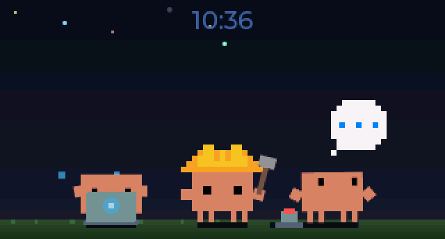
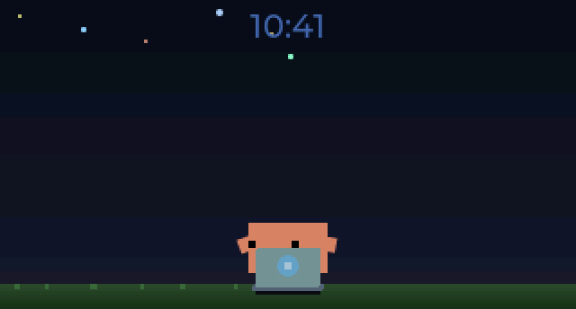
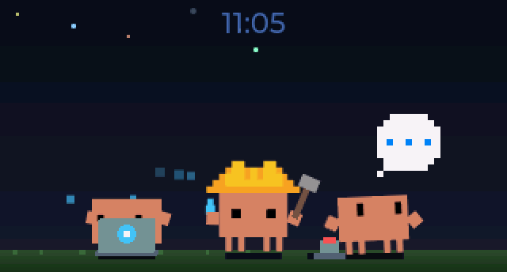
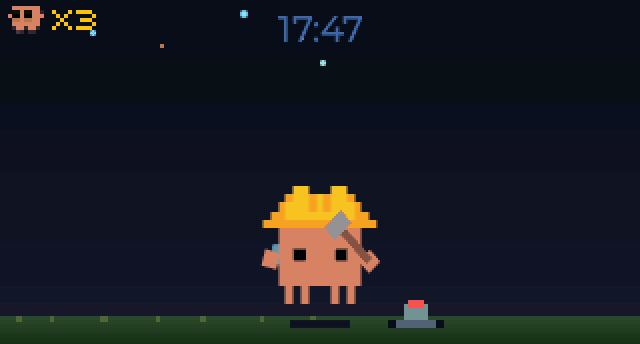
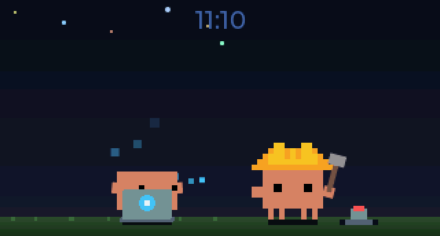

# Changelog

## [Unreleased]

## [1.4.0] - 2026-03-20

### Added

- **Tool-aware animations** — Clawd now shows distinct animations based on which Claude Code tool is active, instead of the same "typing" animation for all tools. 6 tool categories mapped to animations:
  - `Read` / `Grep` / `Glob` → **Debugger** (sneaking with magnifying glass)
  - `Edit` / `Write` / `NotebookEdit` → **Typing** (at laptop, unchanged)
  - `Bash` → **Building** (hard hat + hammer on anvil)
  - `Agent` / subagents → **Conducting** (arms waving, data streaming overhead)
  - `WebSearch` / `WebFetch` → **Wizard** (floating with wand + sparkles)
  - `LSP` / MCP tools (`mcp__*`) → **Beacon** (antenna with radio waves)
  - Unknown tools fall back to Typing.
- **4 new sprite animations** — Debugger (86×43, 48 frames), Wizard (72×129, 48 frames), Conducting (76×78, 16 frames), Beacon (134×127, 64 frames). All at 8fps, generated via sprite pipeline with auto-crop.
- **Narrow-view animation mirroring** — When the notification panel is open (narrow scene), idle and confused sessions adopt the most recent working session's tool animation instead of showing static idle/confused. If no sessions are working, the original animation is preserved.
- **`record_gif.py` v2 support** — GIF recording tool now supports the 4 new animation names via v2 `set_sessions` path in the simulator's `--capture-anim` mode.
- **Improved daemon logging** — Socket messages now log `tool_name` for tool calls, `agent_id` for subagent events, and project name (`[project-name]`) for all sessions. Display state broadcasts log animation names, subagent count, and overflow.
- **Project name tracking** — Project name (from `cwd`) extracted for all hook events and stored on session state. Visible in logs and `sessions.json`.
- **BOOT button clears notifications** — Press the BOOT button (GPIO 9) on the ESP32-C6 board to dismiss all notification cards and return to full-width view. GPIO ISR with 200ms debounce.

### Changed

- **Subagent animation** — Sessions with active subagents now show the **Conducting** animation (arms waving with data stream) instead of Building. Building is now reserved for `Bash` tool use.
- **V1 WORKING_ANIMS** — Legacy v1 `set_status` payload now counts all 6 tool animations as "working" for intensity tier computation (was only `typing` + `building`).

### Fixed

- **Overflow badge hidden in narrow view** — Badge canvas was aligned to screen top-right, placing it behind the notification panel. Now uses `lv_obj_align_to` relative to the scene container, so the badge follows the container edge in both narrow and wide views.

## [1.3.2] - 2026-03-18

### Fixed

- **Notification dismiss destroys multi-session clawds** — Entering or leaving notification view called `scene_set_clawd_anim()` (a v1 single-session function) which destroyed all slots beyond slot 0. Since the daemon only sends `set_sessions` on session state changes, the destroyed clawds were never recreated. Now uses `scene_play_slot0_oneshot()` for the alert animation and skips animation override on dismiss when multi-session is active.
- **Narrow mode empty scenery** — When the notification panel was open and slot 0's session closed, the replacement sprite transferred from a hidden slot retained its hidden flag, leaving an empty scene. The narrow guard now unhides slot 0 and cancels any stale walk-in animation.
- **Disconnect shows extra clawds** — Disconnecting with multiple active sessions left stale session clawds visible alongside the disconnected animation. `scene_set_clawd_anim` now deactivates all extra slots when switching to single-clawd mode.
- **Main clawd goes away on connect** — Connecting with active sessions caused the disconnect clawd to play going-away while new session clawds walked in from offscreen. The disconnect clawd is now adopted as slot 0 and smoothly repositions.
- **Orphaned simulator blocks app reopen** — If the menu bar app crashed, the orphaned simulator process (inside `Contents/MacOS/`) caused macOS to think the app was already running. Simulator binary moved to `Contents/Resources/` so Launch Services no longer blocks reopening. Stale sim processes are also killed synchronously at startup.

## [1.3.1] - 2026-03-18

### Added

- **StopFailure hook** — New Claude Code `StopFailure` hook (v2.1.78) shows a DIZZY animation (X eyes, orbiting stars), error notification card, and triple red LED flash when a session hits an API error (rate limit, auth failure). Error state persists until user resumes or session ends.
- **DIZZY sprite animation** — New `CLAWD_ANIM_DIZZY` sprite (92×72, 32 frames @ 8fps) with X eyes and orbiting stars for the error/crashed state. Generated via Gemini, auto-cropped.

### Fixed

- **Simulator always-on-top** — Fixed always-on-top not working on macOS. Root cause: `SDL_HINT_MAC_BACKGROUND_APP` prevented the window manager from honoring `NSFloatingWindowLevel`. Fix bypasses SDL and sets the NSWindow level directly via native Cocoa API (`objc_msgSend`). Also re-applies pinned state after `SDL_ShowWindow` (macOS resets window level on show).
- **Pinned preference parsing** — Fixed `cJSON_IsTrue` rejecting integer `1` from preferences JSON (rumps saves booleans as integers). Simulator TCP parser now accepts both JSON `true` and integer `1` as truthy for the pinned field.

## [1.3.0] - 2026-03-16

### Added

- **Multi-session display** — Up to 4 concurrent Claude Code sessions rendered as individual Clawd sprites with per-session animations. Protocol v2 `set_sessions` action sends per-session animation state and stable UUIDs. Overflow badge shows "+N" when sessions exceed `MAX_VISIBLE=4`.
  
- **Walk-in animation** — New sessions enter from offscreen with a walking sprite animation. Existing sessions reposition with walk animations when the layout changes.
  
- **Going-away burrowing animation** — Sessions that exit play a burrowing animation instead of a fade-out. Remaining sessions defer repositioning until the burrowing completes.
  
- **HUD subagent counter** — Mini-crab icon with pixel-art bitmap font shows active subagent count. Session overflow badge anchored to container right edge.
  
- **Per-session sweeping** — `PreCompact` events now send a sweep animation only to the compacting session (v2), instead of a global sweep (v1 fallback preserved).
  
- **Protocol version negotiation** — BLE GATT characteristic exposes protocol version (v2). Daemon reads it on connect and selects v1 `set_status` or v2 `set_sessions` payloads per-transport.
- **`query_state` TCP action** — Debug introspection command returns JSON with all slot states, animations, and positions.
- **`gemini_animate.py` tool** — AI-assisted SVG animation generation using Gemini API.
- **New sprite assets** — Going-away burrowing sprite, walking sprite, mini-clawd HUD sprite, with SVG sources.
- **Auto-crop sprite pipeline** — `tools/crop_sprites.py` crops all sprite headers in-place with symmetric horizontal padding (keeps Clawd centered) and free vertical cropping. Reduces frame buffer memory by 69% (1194 KB → 368 KB across all sprites). `tools/analyze_sprite_bounds.py` for bounding box analysis.
- **RGB565A8 pixel format on firmware** — Frame buffers use 3 bytes/pixel (native-with-alpha for 16-bit display) instead of 4 bytes/pixel ARGB8888, saving 25% memory per buffer. New `rle_decode_rgb565a8` decoder in `rle_sprite.h`.
- **Heap diagnostics** — Free heap breakdown (internal SRAM + PSRAM) logged at firmware boot.
- **OOM logging** — Frame buffer allocation failures logged with `ESP_LOGW` instead of silent skip.
- **Custom app icon** — New macOS app icon with Clawd pixel-art crab design, replacing the default py2app icon. SVG source and full iconset included in `assets/`.

### Changed

- **Scene slot architecture** — `MAX_VISIBLE=4` on both platforms. `MAX_SLOTS=6` on firmware (no PSRAM), `MAX_SLOTS=8` on simulator.
- **Sprite dimensions** — All sprites auto-cropped to tight bounding boxes. Largest session sprite is confused at 152x113 (was 180x180). Idle is 72x51, walking is 60x40. y_offsets adjusted to preserve on-screen positioning.
- **`build.sh` always rebuilds** — No stale check; static simulator is always rebuilt to avoid version drift.

### Fixed

- **Firmware build errors** — Fixed `pixel_font.c` missing from firmware CMakeLists (was in simulator only), format specifier mismatches (`%d` → `PRId32`), unused variable/function warnings, and `snprintf` truncation warning.
- **Firmware memory constraints** — ESP32-C6 has no PSRAM (corrected from CLAUDE.md which incorrectly stated 4MB). Removed bogus PSRAM settings from `sdkconfig.defaults`. Sprite cropping + RGB565A8 format ensures multi-session display fits in ~200 KB free internal SRAM.
- **Simulator window resizing** — Replaced integer-step scaling (which left large black dead zones between scale jumps) with continuous float scaling that fills the window smoothly at any size.
- **Aspect ratio enforcement** — Window now locks to the native display aspect ratio (328:180) during resize, eliminating black letterbox bars. Drag direction is detected (horizontal, vertical, or corner) to adjust the correct axis.
- **LED border rendering** — Border now renders uniformly around the content by filling the entire window with the LED color and insetting the framebuffer, instead of computing separate border and content rects with rounding gaps.
- **Narrow mode walk suppression** — Walk animations correctly cancelled when entering narrow mode (notification cards visible).
- **Deferred reposition detection** — Position change detection fixed for post-burrowing repositioning.
- **HUD canvas cleanup** — HUD canvas properly cleared when hiding subagent counter.
- **BLE version reading** — `read_version` return type validated for mock compatibility in tests.
- **Bounds check for empty sessions** — `set_sessions` with empty session list handled safely.
- **BLE reconnection state sync** — Daemon now proactively reconnects when the BLE device drops and immediately syncs time, re-reads protocol version, and replays all active notifications and session state. Previously this only happened when a new hook call arrived.

## [1.2.1] - 2026-03-14

### Added

- **Subagent tracking** — `SubagentStart`/`SubagentStop` hooks track active Claude Code subagents per session. Sessions with active subagents count as "working", preventing Clawd from sleeping during long-running agent tasks.
- **Auto-update hooks on startup** — Hooks are checked and updated automatically on app launch when outdated, removing the need for manual "Install Hooks" clicks after adding new hook types.
- **Daemon health monitoring** — Daemon thread exceptions are caught and logged. Periodic health check timer (30s) detects dead daemon and shows disconnected icon.
- **Orphaned sim process cleanup** — On startup, orphaned simulator processes on the listen port are identified by name and killed instead of silently connecting to them.
- **Session state persistence** — Session state saved atomically to `~/.clawd-tank/sessions.json` on structural changes (state transitions, subagent add/remove). Daemon loads saved state on startup with immediate stale eviction, so restarting the app preserves the correct animation.
- **Simulator logging** — Simulator stdout/stderr routed through Python logger to unified `clawd-tank.log` with `[clawd-tank.sim-process]` tag.
- **Build script** — `host/build.sh` automates static simulator build, py2app, binary bundling, and optional install (`--install`).
- **Version logging** — App version logged on startup for easier debugging.

### Changed

- **Building animation** — Updated sprite with improved visuals.
- **Version numbering on master** — Commit count now measured against `origin/master` (unpushed commits) instead of local `master` (always 0).
- **CI workflow** — `build-macos-app.yml` now builds the static simulator and bundles it into the `.app`, matching `release.yml`.

### Fixed

- **Quit handler race condition** — Sim transport is now removed from daemon before killing the process, avoiding double-disconnect. Sim process is SIGKILL'd immediately instead of waiting 3s for SIGTERM.
- **Session file double-close** — Fixed fd double-close in `save_sessions` error path that could leave orphaned temp files.
- **Test pollution** — Added `conftest.py` with autouse fixture to redirect session persistence to temp dirs, preventing tests from writing to real `~/.clawd-tank/sessions.json`.
- **Stale subagent eviction** — Sessions with dead subagents (missed `SubagentStop` hooks) are now evicted normally by staleness checker, since active subagents keep `last_event` fresh via tool call hooks.
- **Stale launchd plist** — Auto-migrates the Launch at Login plist when it points to a different executable, instead of warning the user to manually re-enable.
- **Display state sync** — `_last_display_state` updated after transport replay to prevent duplicate broadcasts.

## [1.1.0] - 2026-03-14

### Added

- **Session-aware working animations** — Clawd now shows real-time animation states driven by Claude Code session hooks. The tank acts as a workload meter reflecting what Claude is doing across all active sessions.
- **6 new sprite animations** — thinking (tapping chin with thought bubble), typing (frantic keyboard work), juggling (tossing data packets), building (hammering on anvil), confused (looking around with question marks), sweeping (push broom, oneshot for context compaction).
- **Intensity tiers** — Animation scales with concurrent session count: 1 session working = typing, 2 sessions = juggling, 3+ sessions = building.
- **Session state tracking** — Daemon maintains per-session state (`registered → thinking → working → idle → confused`) and computes a single display state via priority resolution.
- **3 new Claude Code hooks** — `SessionStart`, `PreToolUse`, `PreCompact` registered alongside existing hooks.
- **`set_status` BLE/TCP action** — New protocol command for daemon to control device animation state directly.
- **Fallback animation mechanism** — Oneshot animations (alert, happy, sweeping) now return to the current working animation instead of always idle.
- **Simulator `--pinned` flag** — Keeps the window always on top of other windows.
- **Simulator auto-focus** — Window comes to the front on launch.
- **Hook migration detection** — Install button detects outdated hooks and allows reinstallation.

### Changed

- **Sleep model** — Replaced firmware timer-based sleep (5-minute idle) with daemon-driven session-based sleep. No sessions = sleeping. Configurable staleness timeout (default 10 minutes) evicts dead sessions.
- **"Sleep Timeout" → "Session Timeout"** — Menu bar label renamed to reflect new semantics.
- **Default simulator scale** — Changed from 3x to 2x (640×344 window).
- **Clock display** — Now visible in all full-width states (idle, thinking, working), not just idle.
- **`daemon_message_to_ble_payload()`** — Returns `Optional[str]` instead of `str`; session-internal events return `None`.

### Fixed

- **Simulator shutdown freeze** — Fixed hang on exit when a TCP client was connected by closing the client socket during shutdown.
- **Hook reinstallation blocked** — `are_hooks_installed()` now checks all required hooks are present, not just that any hook uses the script.

## [1.0.0] - 2026-03-12

Initial release.

- ESP32-C6 firmware with 5 animated sprites (idle, alert, happy, sleeping, disconnected)
- BLE GATT server for notification management (add/dismiss/clear/set_time)
- NVS-backed config store (brightness, sleep timeout)
- LVGL 9.5 notification card UI with auto-rotation and hero expansion
- macOS menu bar app with daemon control, device config, and hook installer
- Python async daemon with multi-transport (BLE + TCP simulator)
- Native macOS simulator (SDL2) with TCP listener, screenshots, and headless mode
- RLE sprite compression pipeline (svg2frames.py + png2rgb565.py)
- 23 C tests, 68 Python tests
