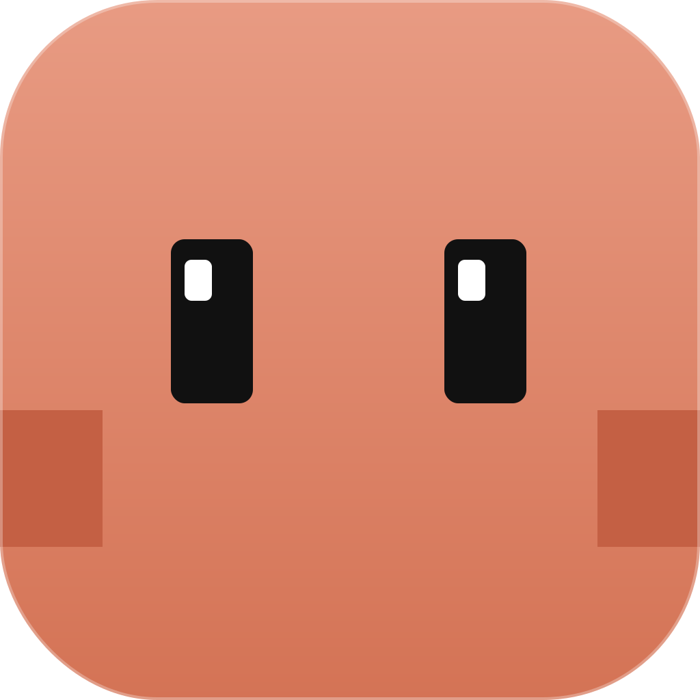
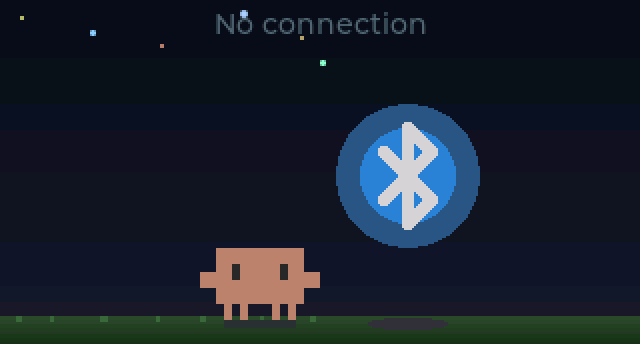
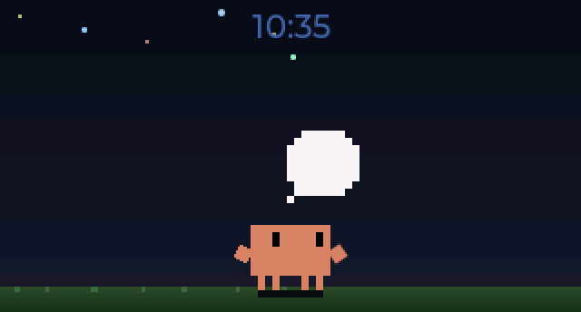
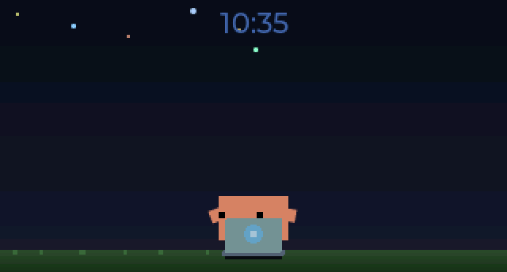
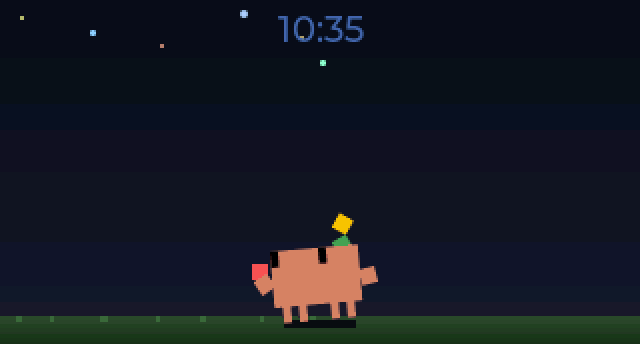
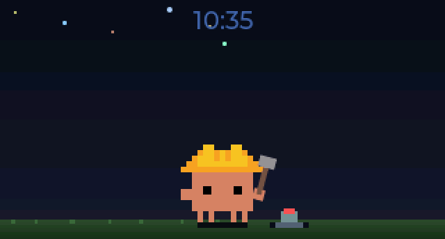
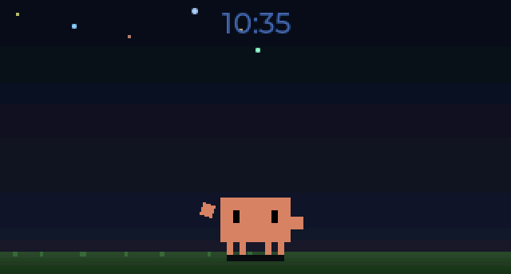
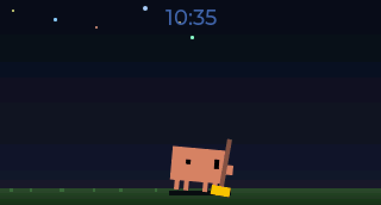
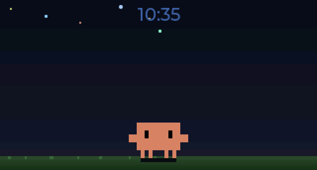
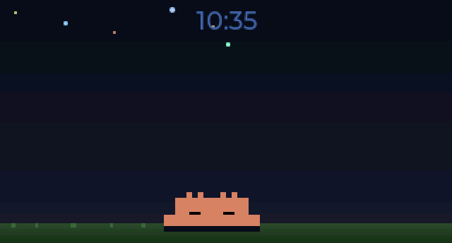

<p align="center">
  
</p>

<h1 align="center">Clawd Tank</h1>

A tiny desktop aquarium for your Claude Code sessions.

Clawd Tank is a notification display for Claude Code built on a [Waveshare ESP32-C6-LCD-1.47](https://s.click.aliexpress.com/e/_c4PGS55v) (320x172 ST7789). An animated pixel-art crab named Clawd lives on the screen, reacting to your coding session — alerting on new notifications, celebrating when you dismiss them, and sleeping when you're away.

**No hardware? No problem.** The simulator runs natively on macOS and ships bundled inside the Menu Bar app. Download it from [Releases](https://github.com/marciogranzotto/clawd-tank/releases) — no build tools needed.

<p align="center">
  
  
</p>

## How It Works

```
Claude Code hooks --> clawd-tank-notify --> daemon --> BLE --> ESP32-C6 display
                                                  \-> TCP --> Simulator (SDL2)
```

1. **Claude Code hooks** (`SessionStart`, `PreToolUse`, `PreCompact`, `Stop`, `Notification`, `UserPromptSubmit`, `SessionEnd`, `SubagentStart`, `SubagentStop`) fire on session events
2. **clawd-tank-notify** (`~/.clawd-tank/clawd-tank-notify`) forwards the event to the daemon via Unix socket
3. The **daemon** tracks per-session state, computes a display state, and sends JSON payloads to connected transports (BLE hardware, TCP simulator)
4. The **firmware** (or simulator) renders Clawd's working animation + notification cards on the LCD via LVGL

## Components

| Directory | What | Language |
|-----------|------|----------|
| `firmware/` | ESP-IDF firmware (LVGL UI, NimBLE GATT server, SPI display) | C |
| `simulator/` | Native macOS simulator — runs the same firmware code without hardware | C |
| `host/` | Background daemon, Claude Code hook handler, macOS menu bar app | Python |
| `tools/` | Sprite pipeline (SVG to PNG to RLE-compressed RGB565), GIF recorder, BLE debugging | Python |

## Hardware

- **Board**: [Waveshare ESP32-C6-LCD-1.47](https://s.click.aliexpress.com/e/_c4PGS55v)
- **Display**: 1.47" 320x172 ST7789V (SPI), 16-bit RGB565
- **SoC**: ESP32-C6FH8 (RISC-V, single core), 8MB flash, 512KB SRAM (no PSRAM)
- **RGB LED**: Onboard WS2812B on GPIO8 — flashes on incoming notifications
- **Connectivity**: BLE 5.0 (NimBLE, peripheral role)

## Quick Start

### Download (no hardware needed)

Grab the latest `.app` from [Releases](https://github.com/marciogranzotto/clawd-tank/releases), unzip, and drag to Applications. The app bundles the simulator — a borderless, resizable window shows Clawd on your desktop, driven by your Claude Code sessions.

On first launch: click the crab icon in the menu bar → **Install Claude Code Hooks**. Restart any running Claude Code sessions.

### Build from source — Simulator

```bash
brew install sdl2 cmake

cd simulator
cmake -B build && cmake --build build

# Interactive mode — opens a borderless, resizable SDL2 window
./build/clawd-tank-sim

# Interactive + TCP listener — daemon can connect and drive it
./build/clawd-tank-sim --listen

# Self-contained binary (no Homebrew SDL2 needed)
cmake -B build-static -DSTATIC_SDL2=ON && cmake --build build-static

# Headless mode — outputs PNG screenshots
./build/clawd-tank-sim --headless \
  --events 'connect; wait 500; notify "clawd-tank" "Waiting for input"; wait 2000; disconnect' \
  --screenshot-dir ./shots/ --screenshot-on-event
```

Interactive keys: `c` connect, `d` disconnect, `n` add notification, `1-8` dismiss, `x` clear, `s` screenshot, `z` sleep, `q` quit. The window is borderless and resizable — drag from center, resize from edges.

When `--listen` is active (default port 19872), the daemon can connect over TCP and drive the simulator with the same JSON protocol used over BLE, enabling the full Claude Code → daemon → display pipeline without hardware.

See [simulator/README.md](simulator/README.md) for full CLI reference and JSON scenario support.

### Firmware

Requires [ESP-IDF 5.3.2](https://docs.espressif.com/projects/esp-idf/en/v5.3.2/esp32c6/get-started/index.html) (bundled in `bsp/esp-idf/`, activated via direnv).

```bash
cd firmware
idf.py build
idf.py -p /dev/ttyACM0 flash monitor
```

### macOS Menu Bar App

The menu bar app bundles the daemon and simulator with a status bar UI. It manages two independent transports — **BLE** (hardware) and **Simulator** (software) — each with their own submenu for enable/disable and connection status.

```bash
# Run from source
cd host && python -m clawd_tank_menubar

# Build and install (builds static simulator, py2app, bundles binary)
cd host && ./build.sh --install

# Or build manually
cd host && pip install py2app && python setup.py py2app
cp ../simulator/build-static/clawd-tank-sim "dist/Clawd Tank.app/Contents/MacOS/"
open "dist/Clawd Tank.app"
```

**Menu features:**
- BLE and Simulator transport submenus with enable/disable toggles
- Simulator window controls: Show/Hide, Always on Top
- Brightness slider, session timeout picker
- Claude Code hook installer
- Version display (tag or branch+N@sha)
- Launch at Login with stale plist detection

On launch, the app automatically installs a hook handler script to `~/.clawd-tank/clawd-tank-notify`. To connect it to Claude Code, click **"Install Claude Code Hooks"** in the menu bar dropdown — this adds the required hooks to `~/.claude/settings.json`. Restart any running Claude Code sessions for hooks to take effect.

Logs are written to `~/Library/Logs/ClawdTank/clawd-tank.log`.

Pre-built releases are available on the [Releases](https://github.com/marciogranzotto/clawd-tank/releases) page.

### Host Daemon (standalone)

The daemon can also run standalone without the menu bar app:

```bash
cd host
pip install -r requirements.txt

# Run daemon with simulator transport
python -m clawd_tank_daemon --sim

# Run daemon with simulator only (no BLE)
python -m clawd_tank_daemon --sim-only
```

The daemon auto-starts on the first hook event. Logs at `~/.clawd-tank/daemon.log`.

## Features

- **Multi-session display** — up to 4 concurrent Claude Code sessions shown as individual animated Clawd sprites, each with their own working animation. New sessions walk in, exiting sessions burrow away
- **Working animations** — real-time session-aware animations driven by Claude Code hooks (thinking, typing, juggling, building, confused, sweeping)
- **Session tracking** — daemon tracks per-session state with priority-based display resolution, staleness eviction, and subagent lifecycle tracking
- **Session persistence** — session state survives daemon restarts, so relaunching the app immediately shows the correct animation for running sessions
- **Time display** — synced from host over BLE on connect (no WiFi/NTP needed)
- **RGB LED flash** — onboard WS2812B cycles through colors on new notifications
- **RLE sprite compression** — all sprite assets compressed ~14:1 (13MB raw → ~900KB)
- **Bundled simulator** — macOS `.app` ships with the simulator binary, no hardware needed. Borderless resizable window with integer pixel scaling
- **Multi-transport** — daemon supports BLE (hardware) and TCP (simulator) transports simultaneously, independently enable/disable
- **Simulator bridge** — full pipeline works without hardware via `--listen` flag and TCP. Window show/hide/pinned controlled over TCP
- **Static SDL2 build** — `STATIC_SDL2=ON` produces a self-contained binary with zero external dependencies
- **Auto-reconnect** — daemon replays active notifications and display state after reconnect on any transport
- **Config over BLE/TCP** — brightness and session timeout adjustable via config characteristic or TCP
- **macOS menu bar app** — transport submenus with colored status indicators, simulator window controls, brightness slider, session timeout, hook installer, version display, launch-at-login

## Clawd's Moods

### Working Animations

Clawd's animation reflects what Claude is doing across all active sessions. With multiple sessions, each gets its own Clawd sprite:

| State | When | |
|-------|------|---|
| **Multi-session** | 2+ concurrent sessions, each with individual animations |  |
| **Thinking** | User submitted a prompt, Claude is reasoning |  |
| **Typing** | 1 session using tools |  |
| **Juggling** | 2 sessions using tools simultaneously (v1) |  |
| **Building** | 3+ sessions using tools simultaneously (v1) |  |
| **Confused** | Claude has been waiting 60s+ for user input |  |
| **Sweeping** | Context compaction (PreCompact) — oneshot |  |

### Notification & Lifecycle

| State | When | |
|-------|------|---|
| **Idle** | Connected, no notifications — Clawd hangs out, full-screen with clock |  |
| **Alert** | New notification arrives — Clawd shifts left, cards appear, LED flashes |  |
| **Happy** | Notifications dismissed |  |
| **Sleeping** | No active sessions — all sessions ended or evicted |  |
| **Disconnected** | No BLE connection — "No connection" message |  |

## Tests

```bash
# C unit tests (notification store)
cd firmware/test && make test

# Python tests (host daemon + protocol)
cd host && pip install -r requirements-dev.txt && pytest
```

## Sprite Pipeline

Clawd's animations are pixel art generated as animated SVGs, rendered to PNG frame sequences, and converted to RLE-compressed RGB565 C headers:

```bash
# SVG animation → PNG frames (requires Playwright)
python tools/svg2frames.py assets/svg-animations/clawd-working-thinking.svg /tmp/frames/ \
  --fps 8 --duration auto --scale 4

# PNG frames → C header
python tools/png2rgb565.py /tmp/frames/ firmware/main/assets/sprite_thinking.h --name thinking

# Record seamlessly-looping GIFs of all animations (for docs)
python tools/record_gif.py --all assets/captures/
```

## BLE Debugging

```bash
# Interactive BLE tool — connect, send notifications, read config
python tools/ble_interactive.py
```

## License

MIT
