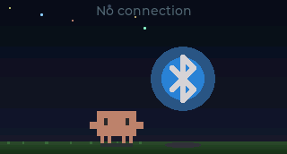
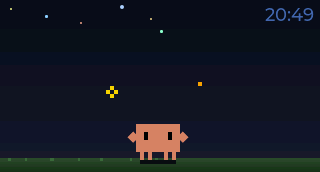
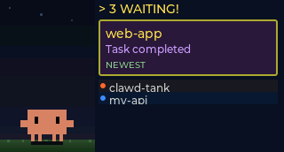

# Clawd Tank

A tiny desktop aquarium for your Claude Code sessions.

Clawd Tank is a physical notification display built on a [Waveshare ESP32-C6-LCD-1.47](https://www.waveshare.com/esp32-c6-lcd-1.47.htm) (320x172 ST7789). An animated pixel-art crab named Clawd lives on the screen, reacting to your coding session — alerting on new notifications, celebrating when you dismiss them, and sleeping when you're away.





## How It Works

```
Claude Code hooks --> clawd-tank-notify --> daemon (BLE) --> ESP32-C6 display
```

1. **Claude Code hooks** fire on notifications (task complete, idle prompt, etc.)
2. **clawd-tank-notify** forwards the event to a background Python daemon via Unix socket
3. The **daemon** maintains a BLE connection and sends JSON payloads to the device
4. The **firmware** renders Clawd + notification cards on the LCD via LVGL

## Components

| Directory | What | Language |
|-----------|------|----------|
| `firmware/` | ESP-IDF firmware (LVGL UI, NimBLE GATT server, SPI display) | C |
| `simulator/` | Native macOS simulator — runs the same firmware code without hardware | C |
| `host/` | Background daemon + Claude Code hook handler | Python |
| `tools/` | Sprite pipeline (PNG to RLE-compressed RGB565), BLE debugging tool | Python |

## Hardware

- **Board**: Waveshare ESP32-C6-LCD-1.47
- **Display**: 1.47" 320x172 ST7789V (SPI), 16-bit RGB565
- **SoC**: ESP32-C6FH8 (RISC-V, single core), 8MB flash, 4MB PSRAM (octal)
- **RGB LED**: Onboard WS2812B on GPIO8 — flashes on incoming notifications
- **Connectivity**: BLE 5.0 (NimBLE, peripheral role)

## Quick Start

### Simulator (no hardware needed)

```bash
brew install sdl2 cmake

cd simulator
cmake -B build && cmake --build build

# Interactive mode — opens an SDL2 window
./build/clawd-tank-sim

# Headless mode — outputs PNG screenshots
./build/clawd-tank-sim --headless \
  --events 'connect; wait 500; notify "clawd-tank" "Waiting for input"; wait 2000; disconnect' \
  --screenshot-dir ./shots/ --screenshot-on-event
```

Interactive keys: `c` connect, `d` disconnect, `n` add notification, `1-8` dismiss, `x` clear, `s` screenshot, `q` quit.

See [simulator/README.md](simulator/README.md) for full CLI reference and JSON scenario support.

### Firmware

Requires [ESP-IDF 5.3.2](https://docs.espressif.com/projects/esp-idf/en/v5.3.2/esp32c6/get-started/index.html) (bundled in `bsp/esp-idf/`, activated via direnv).

```bash
cd firmware
idf.py build
idf.py -p /dev/ttyACM0 flash monitor
```

### Host Daemon

```bash
cd host
pip install -r requirements.txt
./install-hooks.sh  # prints hook config for ~/.claude/settings.json
```

The daemon auto-starts on the first hook event. Logs at `~/.clawd-tank/daemon.log`.

## Features

- **Time display** — synced from host over BLE on connect (no WiFi/NTP needed)
- **RGB LED flash** — onboard WS2812B flashes warm orange behind acrylic on new notifications
- **RLE sprite compression** — all sprite assets compressed ~14:1 (13MB raw → ~900KB)
- **Auto-reconnect** — daemon replays active notifications after BLE reconnect
- **Config over BLE** — brightness and sleep timeout adjustable via config characteristic

## Clawd's Moods

| State | When |
|-------|------|
| **Idle** | Connected, no notifications — Clawd hangs out, full-screen with clock |
| **Alert** | New notification arrives — Clawd shifts left, cards appear, LED flashes |
| **Happy** | Notifications dismissed |
| **Sleeping** | 5 minutes of inactivity |
| **Disconnected** | No BLE connection — "No connection" message |

## Tests

```bash
# C unit tests (notification store)
cd firmware/test && make test

# Python tests (host daemon + protocol)
cd host && pip install -r requirements-dev.txt && pytest
```

## Sprite Pipeline

Clawd's animations are pixel art created in [Piskel](https://www.piskelapp.com/), exported as PNG frames, and converted to RLE-compressed RGB565 C headers:

```bash
python tools/png2rgb565.py frames/ output.h --name sprite_idle
```

Web-based editors for each animation are in `tools/sprite-designer/`.

## BLE Debugging

```bash
# Interactive BLE tool — connect, send notifications, read config
python tools/ble_interactive.py
```

## License

MIT
